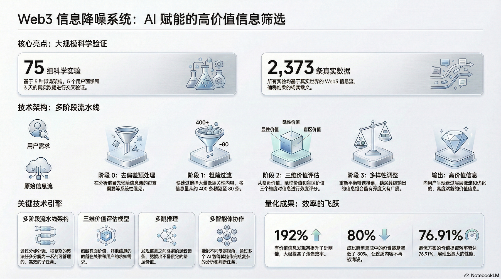

# Web3 Info Denoise

> **一个会"进化"的 AI 信息助手**
> 
> 不是又一个套壳 ChatGPT，而是一个能自我学习、自我优化的智能系统

---

## 我们解决什么问题？

**信息过载正在吞噬你的时间。**

每天 200+ 条 Web3 资讯，你花 2 小时刷完，真正有价值的可能只有 15 条。

更糟糕的是——**那些对你最重要的信息，往往被埋在噪音里。**

---

## 我们的解法：让 AI 像生物一样"进化"

### 不是规则，是智能

传统方案用关键词过滤、用算法打分。**我们不写规则，我们让 AI 自己学会理解你。**

```
传统方案：人写规则 → 机器执行 → 僵化、容易过时

我们的方案：AI 理解用户 → AI 自己决策 → 动态、自适应
```

### 三层价值评估，发现你不知道自己需要的

| 价值层 | 含义 | 示例 |
|--------|------|------|
| **显性价值** | 你明确关注的 | 你关注 DeFi，推送 DeFi 新闻 |
| **隐性价值** | 逻辑上对你有用的 | 你做套利，推送交易所 API 变更 |
| **盲区价值** | 你不知道自己需要的 | 你专注交易，推送监管政策变化 |

**普通 AI 只能做到第一层，我们做到第三层。**

### 自我进化的闭环

```
用户使用 → AI 观察反馈 → AI 更新对用户的理解 → 推荐更精准 → 用户更满意
     ↑                                                              ↓
     └──────────────────────────────────────────────────────────────┘
```

**没有人工干预，没有规则维护，AI 自己越用越懂你。**

---

## 我们用数据证明了这一切

**不是拍脑袋，是 75 组科学实验验证。**



### 实验规模

| 维度 | 数据 |
|------|------|
| 筛选架构 | 5 种完全不同的设计 |
| 用户画像 | 5 种差异化用户类型 |
| 信息数据 | 2,373 条真实 Web3 资讯 |
| 实验总数 | **75 组完整实验** |

### 量化成果

| 指标 | 改善幅度 |
|------|---------|
| 有价值信息发现率 | **↑ 192%** |
| 位置偏差 | **↓ 80%** |
| 价值提取效率 | **76.91%** |

> 详细数据和方法论见 [TECHNICAL_APPENDIX_FOR_HACKATHON.md](./TECHNICAL_APPENDIX_FOR_HACKATHON.md)

---

## 这个项目本身就是 Human-AI 协作的产物

**我们不只是"用" AI，我们"驱动" AI 做一切。**

| 环节 | 谁做的 |
|------|--------|
| 定义问题 | Human |
| 设计 5 种架构方案 | AI |
| 编写全部代码 | AI |
| 执行 75 组实验 | AI |
| 分析数据、得出结论 | AI |
| 决策采用哪个方案 | Human |

**Human 提目标，AI 自己执行、自己验证。**

这不是未来的工作方式，这是我们正在实践的工作方式。

---

## 快速开始

```bash
# 克隆
git clone https://github.com/justDance-everybody/web3_info_denoise.git
cd web3_info_denoise

# 配置
cp bot/.env.example bot/.env
# 编辑 .env，填写 TELEGRAM_BOT_TOKEN 和 LLM API Key

# 启动
docker compose up -d
```

---

## 文档

| 文档 | 说明 |
|------|------|
| [技术验证文档](./TECHNICAL_APPENDIX_FOR_HACKATHON.md) | 75 组实验的完整记录 |
| [实验报告](./EXPERIMENT_REPORT.md) | 详细技术分析 |
| [实验数据](./test_data/) | 原始数据，欢迎验证 |

---

## License

MIT
